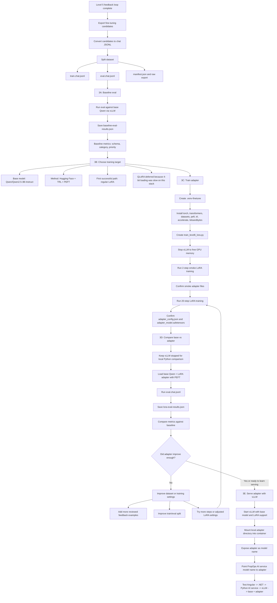
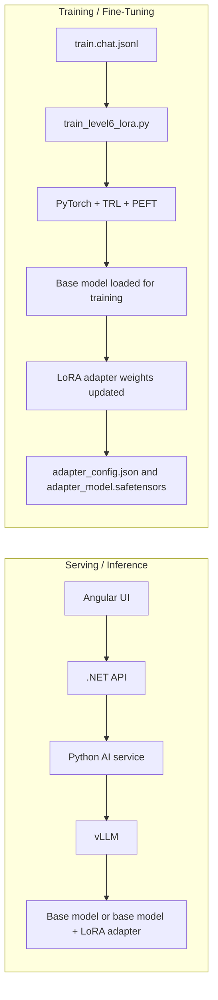

# Level 6 Model Specialization Flow

This diagram captures the current Level 6 learning path for PropOps Copilot: local model serving with vLLM, dataset export, LoRA training, evaluation, and later serving the tuned adapter.



## Runtime Separation



Key rule:

```text
vLLM is for inference/serving.
PyTorch + TRL + PEFT is for training.
Stop vLLM during local training/eval if GPU memory is needed.
Restart vLLM when serving the base model or tuned adapter.
```

## Current Checkpoint

```text
Step 12 serving base model with vLLM: done
3A baseline eval: done
3B target/method choice: done
3C LoRA adapter training: done
3D base vs LoRA comparison: done
3E serving LoRA through vLLM: done
```

Current app-facing model:

```text
PROP_OPS_AI_MODEL_NAME=propops-qwen2.5-3b-lora
PROP_OPS_AI_OPENAI_BASE_URL=http://host.docker.internal:8001/v1
```

The verified runtime path is:

```text
Angular -> .NET API -> Python AI service -> vLLM -> propops-qwen2.5-3b-lora
```
